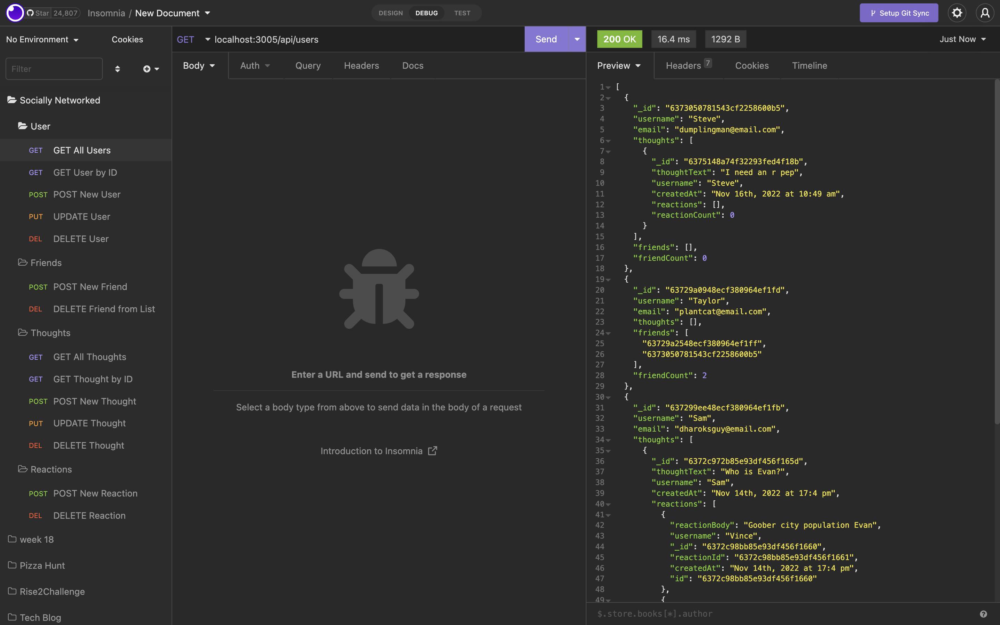

# Socially Networked

## License
### 
### [MIT](https://opensource.org/licenses/MIT)

## Description

This application is a web api for a social network app that operates using NoSQL. This applcation is an MVP framework with standard social network functionality to so developers can improve on the user experience and users can connect with one another to share their thoughts and create friendships.

By: [Vincent Toon](https://github.com/Vincenttoon)

## Table of Contents

* [Installation](#installation)

* [Technologies](#technologies)

* [Tests](#tests)

* [Usage](#usage)  

* [Contributors](#contributors)

* [Future Improvements](#future-improvements)

* [Questions?](#questions)

## Installation

* Head to the repository to download or view this code: [Socially Networked](https://github.com/Vincenttoon/socially-networked)

- Go to Github link listed in read me 

- Install code on your local machine

- Install `node_modules` 

- Run `npm start` 

- Enjoy.

## Technologies

* npm packages used: 

- [express](https://www.npmjs.com/package/express)

- [mongoose](https://www.npmjs.com/package/mongoose)

- [nodemon](https://www.npmjs.com/package/nodemon)

## Tests

- [Video Demonstration for Socially Networked](https://drive.google.com/file/d/1HL36HXjLicmvGqV4fKc-mVsU6iTGMhCx/view)

## Usage

Users can GET, POST, PUT and DELETE unique User's and their Thought's, similar to the popular message board social network platforms. Also, Users can react to other user's thoughts by reacting to them, as well as adding other users as friends. Both the reactions and friends can be removed as well.

## Contributors

* n/a

### Future Improvements

* Create a front end for the website to allow for user interaction outside of developers

* Allow for posting of images along with thoughts

* Allow for link attachments to allow users to share web information cleanly

## Questions?

Questions, comments, or concerns? Please Email me at:
* vincenttoon22@gmail.com